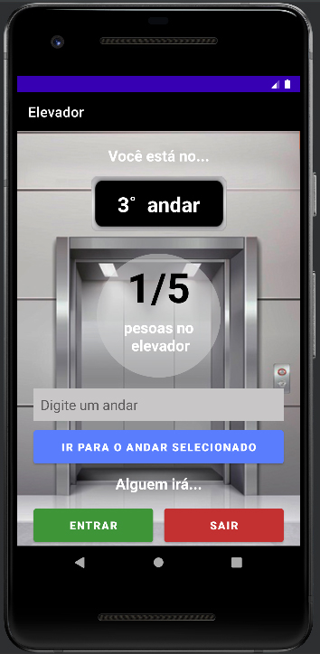

<h1> Elevador </h1> 
  
<h3>Descrição do projeto</h3> 
  

Aplicação que simula o funcionamento de um elevador. 
Na tela, são exibidas as opções para que o usuário escolha o andar   desejado e se o passageiro irá entrar ou deixar o elevador.
 
  
<h3>Funcionalidades</h3>
  
✔️ Exibição em tela do andar atual durante a simulação de subida/descida dos andares. 
✔️ Exibição de aviso por Toast para que o usuário respeite a capacidade máxima de lotação (5 pessoas). 
✔️ Exibição de mensagem de erro para evitar que o usuário insira algum andar inválido (Intervalo possível: 0 a 7).  
  
Status do Projeto: Concluído ✔️ 

</img>
