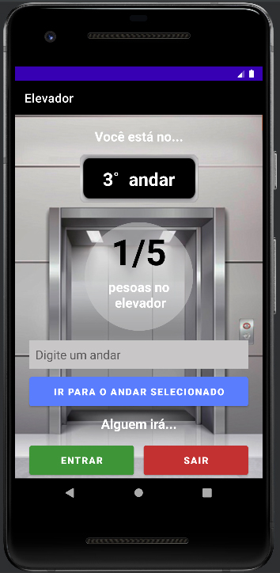

<h1>Elevador</h1>

<h3>Descrição do projeto</h3>

Aplicação que simula o funcionamento de um elevador. 

Na tela, são exibidas as opções para que o usuário escolha o andar desejado e se o passageiro irá entrar ou deixar o elevador.

<h3>Funcionalidades</h3> 

✔️ Exibição em tela do andar atual durante a simulação de subida/descida dos andares. 
✔️ Exibição de aviso por Toast para que o usuário respeite a capacidade máxima de lotação (5 pessoas). 
✔️ Exibição de mensagen de erro para evitar que o usuário insira algum andar inválido (Intervalo possível: 0 a 7). 

  
Status do Projeto: Concluído ✔️  

</img>
