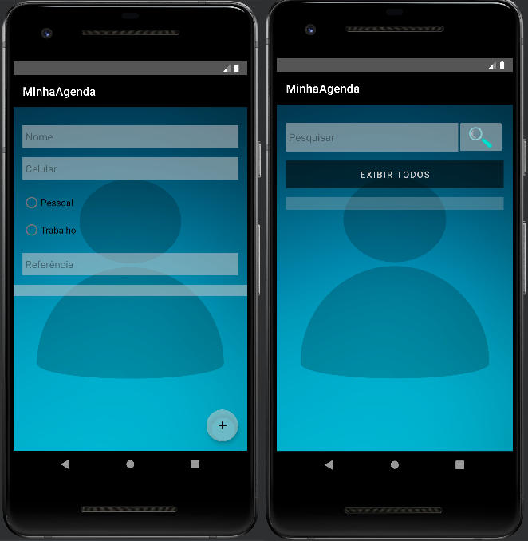

<h1>Minha Agenda</h1>

<h3>Descrição do projeto</h3>

Aplicação Android de agenda, nela, você insere o nome da pessoa, o celular e marca as seguintes opções:  

Se for um contato de trabalho, deverá incluir o e-mail. 
Se for um contato pessoal, deverá ter um campo para identificar aonde conheceu essa pessoa.

<h3>Funcionalidades</h3> 

✔️ Listar todos os contatos. 
✔️ Pesquisar por um contato específico. 
✔️ Ao salvar um novo contato, a lista retorna ao ser estado inicial, mostando todos os contatos em ordem alfabética. 

  
Status do Projeto: Concluído ✔️  

</img>
