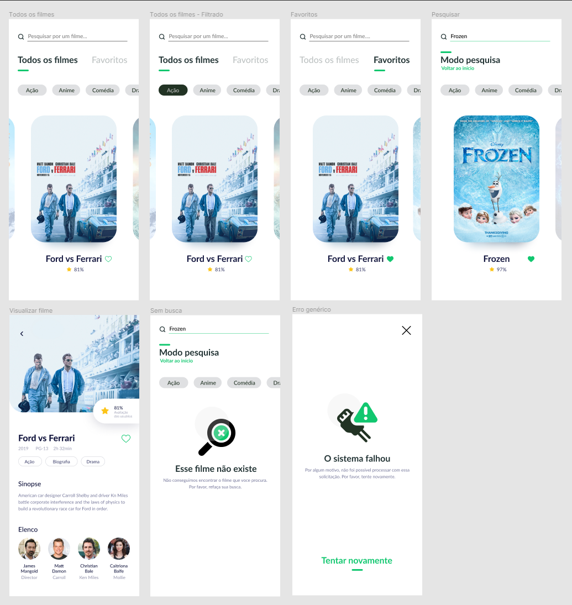

<h1>Projeto Integrador</h1>

<h3>Descrição do projeto :iphone:</h3> 

<h3>Requisitos:</h3> 

:pushpin: A aplicação deve estar fiel a UI;
:pushpin: O projeto deve estar modularizado, seguindo
os padrões de arquitetura Clean e MVVM;
:pushpin: A aplicação deve armazenar os filmes
favoritos localmente;
:pushpin: Utilize o Crashlytics para mapear eventuais
falhas de uso;
:pushpin: Não se esqueça de adicionar os testes
automatizados das funcionalidades criadas.

<h2>Início :triangular_flag_on_post:</h2> 
:small_blue_diamond: Existem duas categorias: todos os filmes listados bem como os filmes favoritos do usuário. 

<h2>Filtro :triangular_flag_on_post:</h2> 
:small_blue_diamond: Ao tocar em uma categoria, os filmes são filtrados. É importante
mencionar que em modo pesquisa, esse filtro também pode ser aplicado.

<h2>Exibição de filme :triangular_flag_on_post:</h2> 
:small_blue_diamond: Ao escolher um filme, é exibido se ele é favoritado ou não, sua sinopse, avaliação e seu elenco.

<h2>Modo pesquisa :triangular_flag_on_post:</h2> 
:small_blue_diamond: Ao iniciar a digitar no campo de busca, é mostrada uma nova tela com os resultados da busca. 
É possível voltar pro estado anterior limpando o campo ou através do link abaixo do título.

<h2>Cenários infelizes :triangular_flag_on_post:</h2> 
:small_blue_diamond: Os cenários mapeados são: erros genéricos para quaisquer falhas de requisição e filme não encontrado em uma busca.

  
Status do Projeto: Em Desenvolvimento ✔️  

</img>
